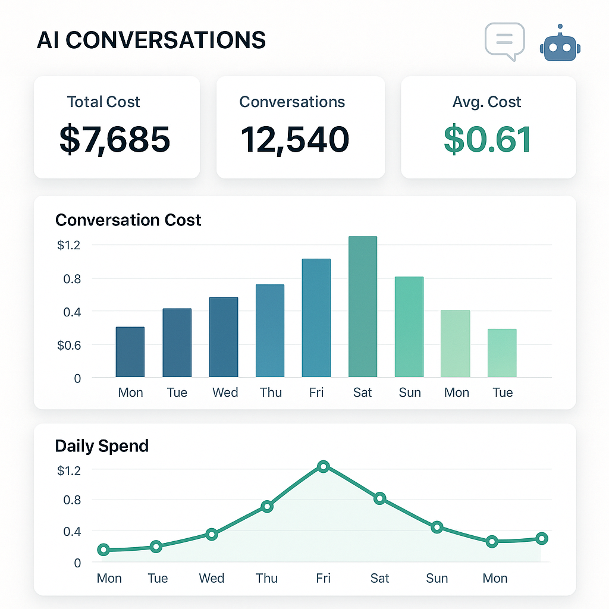

# claude-code-costs



Analyze your Claude Code conversation costs with interactive visualizations.

## Installation

You don't need to install anything! Just run:

```bash
npx claude-code-costs
```

## What it does

This tool analyzes all your Claude Code conversations stored in `~/.claude/projects/` and:

- Calculates total costs across all conversations
- Shows daily cost breakdown for the last 30 days
- Lists top 20 most expensive conversations
- Provides project-based filtering
- Generates an interactive HTML report with charts

The report is automatically generated in your system's temp directory and opened in your default browser.

## Requirements

- Node.js 14.0.0 or higher
- Claude Code conversations stored in the default location (`~/.claude/projects/`)

## Output

The tool provides:

1. Console summary of costs and top expensive conversations
2. Interactive HTML report with:
   - Total cost summary
   - Daily cost chart (last 30 days)
   - Top 20 conversations bar chart
   - Detailed table with filtering by project

## License

MIT
